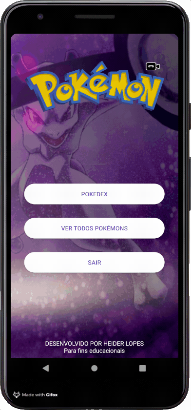

# FIAP - Aplicativo Pokemon para usar WebServices

Feito em aula, na Aula de Android, FIAP - MBA em Mobile Development

Professor: Heider Lopes

Assuntos abordados:
* Retrofit
* HTTP Requests
* HTTP Responses
* WebServices
* Dependency Injections
* Koin
* Animation
* Camera
* ZXing
* BarCode/QrCode Reading
* Debugging
* Splash
* Uses Permission
* Recycler View